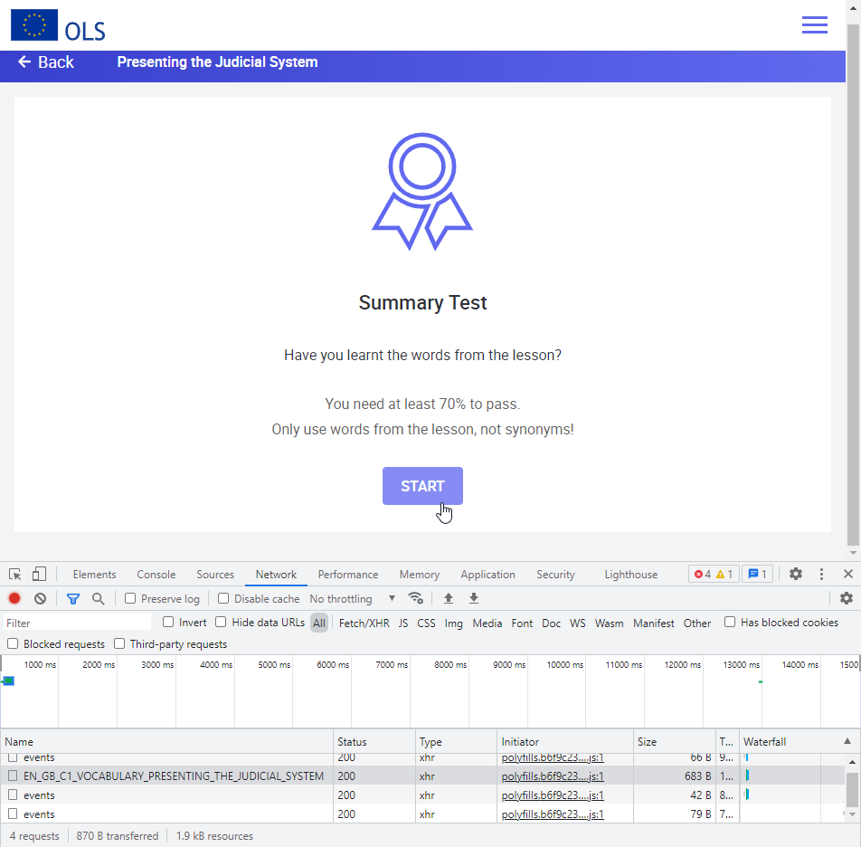
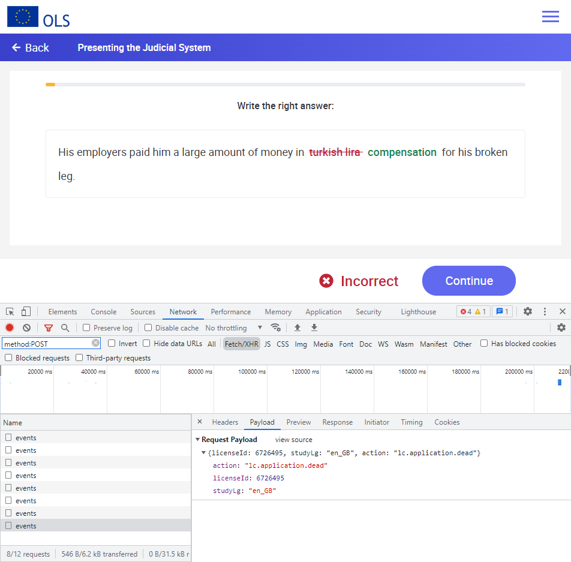
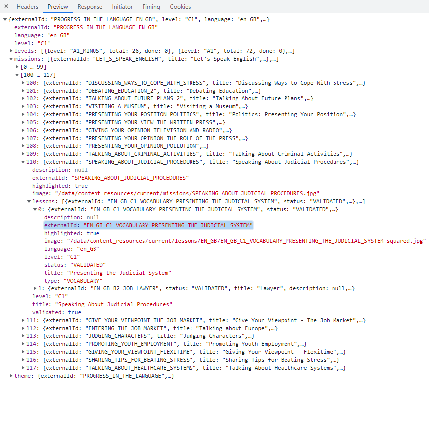
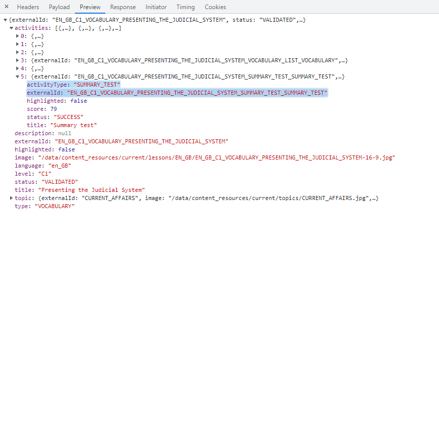
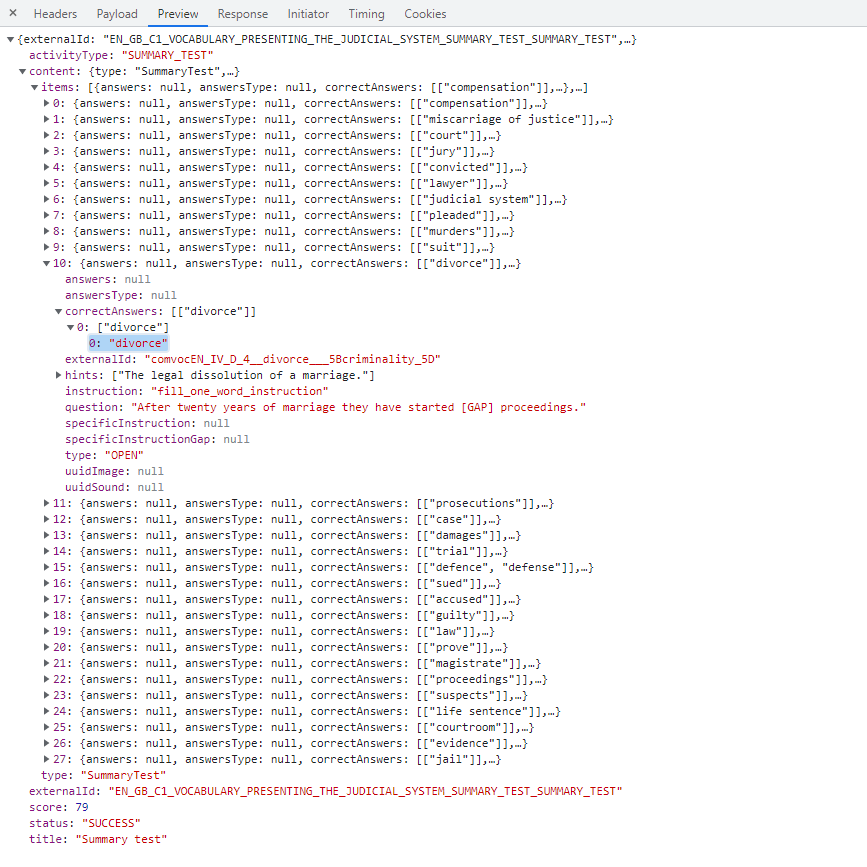
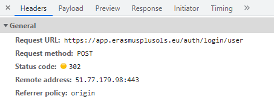
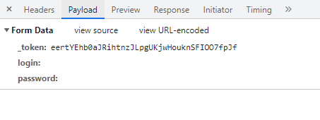
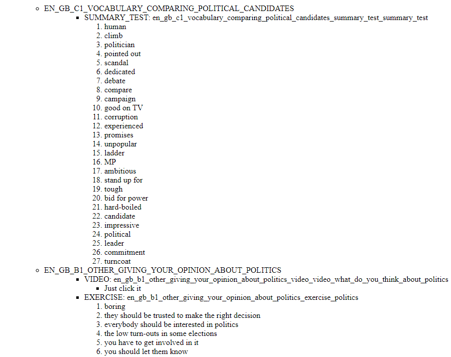

# _***OLS FETCHER***_

## Abstract

OLS_fetcher is a webscrapping python script gathering the answers to Erasmus students' beloved OLS obligatory on-line language course.

It deals only with the C1-level english course, which concerned me the most, yet extending it to other levels can be done easily. Presumeably extension can be done in the languages dimension as well, but due to it being limited to only one per account I had no access to the structure of other courses' HTTP requests schema.

The readme here serves a purpose of a private project summary, since the code itself is quite self-explainatory additionally described by comments.

### Used libraries:

- Json
- Regex
- Requests
- BeautifulSoup4


<hr>

## The site

- ### The way OLS should work:

    The course itself becomes accessable after passing a leveling exam (of the language one specifies as a language of lecture of chosen university), which takes place before the Erasmus mobility. Then he becomes obligated to finish it, spending at least 15 hours on the OLS site.

    The expected way to pass the C1 english course is to complete **14 missions** consisting of **1 to 5 lessons each**, every made up **of 1 to 8 activities** (The choice of nomenclature will become clear later).

    Fortunately, even though one has to pass every lesson to finish a mission, it is not required to solve all of the lesson's activities to make it happen. That's the beauty of **summary tests**, the only one type of activities that allows us to skip everything else, finishing the lesson by passing it. In the opposite case, one has to pass all activities contained within the lesson, often including **exercises**, the second and the last type of acivity that requires prividing answers. The **rest of them** (such as vocabulary lists, videos and pronouciation - with the last happening to be skipped every time) **doesn't requite attention**. Those, if the absence of summary exam occurs, require us only to click through them.

    It is worth to note that the amount of attempts to any of those, inlcuding exams, is not limited, even though we're not exploiting that aspect.

- ### The exploit:

    While solving the exam or exercise and commiting a mistake, the green, correct answer gets displayed. Playing around with chrome's DevTools shows, that it is not a response from the site's servers.

     
    

    As no POST requests are made during the examination but we recieve a correction (or validation) it is unavoidable that we store the answers locally, and thus have an access to them even before we even begin the assigment.

    Thus the main focus of the script is to send the requests to recieve exactly these informations and transform them to a readable format afterwards. 

- ### Map and structure of requests:

    It all can be limited to three GET requests, all of which recieve a json file:

    |   | Address                                                                                                                       | Required headers                | Thing we get from the json                                               |
    |---|-------------------------------------------------------------------------------------------------------------------------------|---------------------------------|--------------------------------------------------------------------------|
    | 1 | https://app.erasmusplusols.edu/gw//lcapi/main/api/lc/user-learning-paths/language/en_GB                                       | x-altissia-token, x-devide-uuid | Missions (each contains a list of its lessons' with their externalIds)   |
    | 2 | https://app.erasmusplusols.eu/gw//lcapi/main/api/lc/lessons/***lesson's externalId***                                         | x-altissia-token, x-device-uuid | A list of activities, each labeled with their externalId  and their type |
    | 3 | https://app.erasmusplusols.eu/gw//lcapi/main/api/lc/lessons/***lesson's externalId***/activities/***activitie's externalId*** | x-altissia-token, x-device-uuid | A list of correct answers                                                |

    Their exact structure  &ndash;  to the extend that concerns us  &ndash;  can be seen on screenshots below:

    
    
    
    

- ### Signing in:

    The first track of trickery directed against our effort is a hidden field in the [sign-in form](https://app.erasmusplusols.eu/). The headers of the signing POST request consist not only of the email and the password, but also a randomly generated, easy to scrap "_token" as shown below:

    ```
    <h1>Welcome to Online Linguistic Support (OLS)!</h1>
        <form class="form-erasmus form-login" autocomplete="off" action="https://app.erasmusplusols.eu/auth/login/user" method="POST" role="form">
            <input type="hidden" name="_token" value="eertYEhb0aJRihtnzJLpgUKjwHouknSFIOO7fpJf">
            <div class="form-item email">
                <label for="era-login">Login or email</label>
                <input id="era-login" type="text" name="login" value="">
            </div>
            <div class="form-item password">
                <label for="era-password">Password</label>
                <input id="era-password" type="password" name="password">
            </div>
            <div class="form-actions bottom centered">
                <button type="submit" class="button regular">Log in</button>
            </div>
        </form>
    ```

    A post request without credentials, serving as a example:

    

## The script

Since it's a single file script, is easly readable due to inormative comments. 
In steps, the script has to:

1. Sign in as a user.
2. List missions for the C1 level.
3. List activities within them.
4. Decide, which of those are necessary to pass the lesson, creating a new dictionary.
5. Write down the instructions in the format of nested html lists.

Even though the result get's stripped down not to include non-obligatory activities, we do compile a "full list" of lessons (named "curriculum" in the script) directly after extracting the necessary features from json's. The computing cost at such scale is marginal, but acknowledging it was important.

## Reading the list

This list consists of steps necessary and sufficient to pass OLS's C1 english course. The first level is composed of unordered lesson titles. The second level has the form of ACIVITY_TYPE: id_of_activity with the third level being either an instruction of "Just clicking it" or a ordered list of test's / exercise's correst answers.


